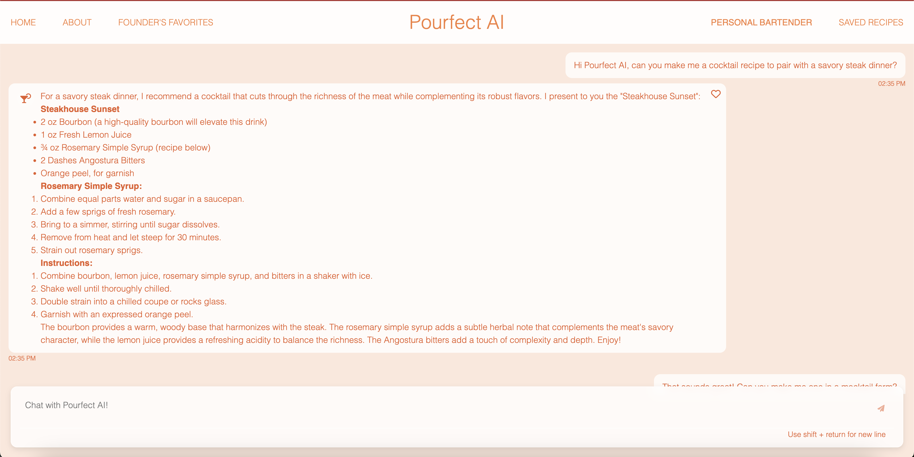
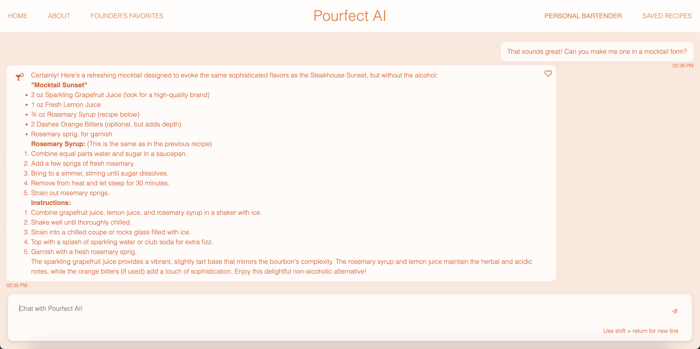
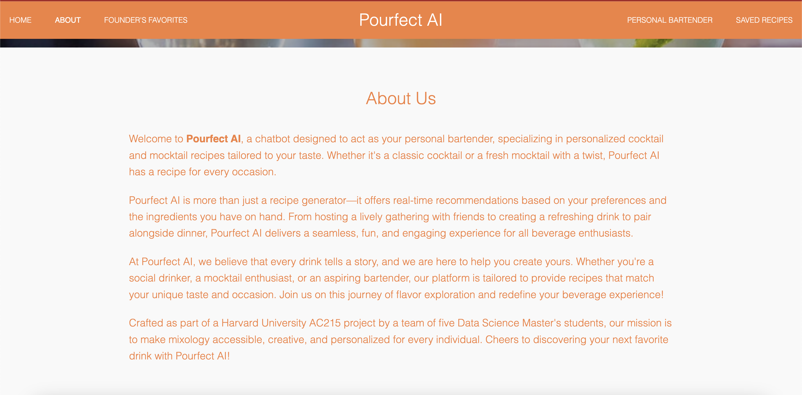
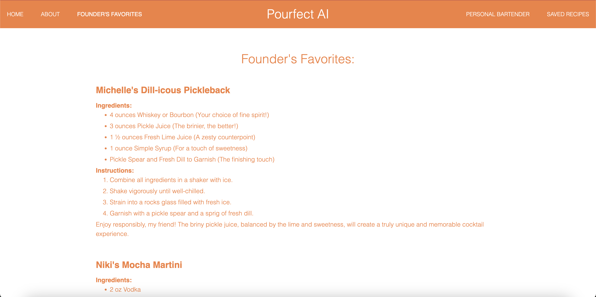

# Pourfect AI

**Team Members**

Niki Ekstrom, Soline Boussard, Michelle Hewson, Sydney Levy, Aida York

**Group Name**

Git Girls 

**Pourfect AI - Project Overview**

Pourfect AI is a fully developed application that leverages user input and preferences to deliver personalized cocktail recommendations. With Pourfect AI, users can input the ingredients they have on hand and instantly discover cocktail recipes that match, helping to reduce waste and optimize ingredient use. The app also innovates by crafting unique cocktail recipes tailored specifically to the available ingredients. Users can explore cocktails based on their taste preferences, occasions, or type of glassware. Detailed recipe instructions are provided, with options for both alcoholic and non-alcoholic variations. The chatbot remembers user preferences, ensuring a highly personalized and seamless cocktail-making experience. Powered by a robust Retrieval-Augmented Generation (RAG) system and fine-tuned LLM models, Pourfect AI is the ultimate cocktail expert at your fingertips.

Read about Pourfect AI on Medium [here](https://medium.com/@sboussard/pourfect-ai-cc194de7b6cf)! 

Access our website [here](http://34.23.190.158.sslip.io/) or using the following QR Code:
* 

### Prerequisites and Setup Instructions ###
Before deploying the app ensure the following pre-requisites are met:
* Ensure the following API's are enabled on GCP:
  *   Compute Engine API
  *   Service Usage API
  *   Cloud Resource Manager API
  *   Google Container Registry API
* To setup a service account you will need to go to GCP Console, search for "Service accounts" from the top search box. or go to: "IAM & Admins" > "Service accounts" from the top-left menu and create a new service account
* Ensure you have a service account called deployment with the following roles:
  *   Compute Admin
  *   Compute OS Login
  *   Container Registry Service Agent
  *   Kubernetes Engine Admin
  *   Service Account User
  *   Storage Admin
* Ensure you have another service account called gcp-service with the following roles: 
  *   Storage Object Viewer
  *   VertexAI Administrator
* Once these service accounts are created download the keys and call them `gcp-service.json` and `deployment.json`
  *  Create a secrets folder inside `src/deployment` and ensure that both jsons are inside of it

### Deployment Instructions ###
In order to deploy updates to the app on Kubernetes using Google Container Registry:
* Start the Deployment Docker Container
  * cd into `src/deployment`
  * run `sh docker-shell.sh`
* Check that you are authenticaed to GCP by running `gcloud auth list`
* Build and push your updated docker  containers to Google Container Registry, and update the Kubernetes clutser
  * `sh deploy-k8s-update.sh`
    * This will automatically run `ansible-playbook deploy-docker-images-app.yml -i inventory.yml` and `ansible-playbook update-k8s-cluster.yml -i inventory-prod.yml`

### Usage details and examples ###
To use our app go to the following link:
  * http://34.23.190.158.sslip.io/

Once on the homepage you will have access to the following pages:
* Home
  * From this page you have the option to chat with your personal bartender or scroll down to learn more about the project 
* About
  * This page provides additional information about Pourfect AI in terms of it's capabilities, unique value proposition, and why the platform was created. 
* Founter's Favorites
  * Here we highlight one recipe from each of Pourfect AI's founders. The best part, these recipes were all crated by Pourfect AI! 
* Personal Bartender
  * The best part of Pourfect AI, this page allows the user to get personalized cocktail / mocktail recipes by conversing with the chatbot. While conversing, user's can heart their favorites recipes in order to save them. 
* Saved Recipes
  * After saving a recipe on the Personal Bartender page, a user can access this page to see all the recipes they have saved and want to come back to. 

Example Usage
* As a user accesses the website they will be shown the following homepage:
  * 
* After clicking on 'Chat with Your Personal Bartender` the user is taken to the following page where they can converse with our chatbot:
  * 
* They can also ask for different variations of provided drinks, such as requesting a mocktail:
  * 
* After saving recipes, the user can click on the Saved Recipes page to display all their favorite drinks:
  * 
* If the user wants to learn more about the project they will see the following information on the About Us page
  * 
* Finally, if the user wants drink inspiration from the Founder's they will see the following recipes on the Founder's Favorites Page
  * 

### Known Issues and Limitations ###
* Pourfect AI is designed for users globally, but it's important to note that users under the legal drinking age in their respective countries (e.g., under 21 in the United States) must not consume alcoholic beverages.
* Pourfect AI's ability to match ingredients to recipes depends on the comprehensiveness and accuracy of the provided materials in the RAG database. Users with niche or uncommon ingredients might not receive suitable recommendations.
* The app's performance may degrade under heavy traffic or with a large number of concurrent users due to limitations in the current deployment architecture.
* Personalized recommendations may not always meet user expectations, as the RAG (Retrieval-Augmented Generation) model relies on the training data quality and user inputs for optimal suggestions.
* While measures are in place to validate and sanitize inputs, not all potential avenues for malicious activity have been exhaustively tested. Users attempting to hack or manipulate input prompts might exploit vulnerabilities, potentially compromising system integrity or disrupting service.

### Video Presentation
For a video walkthrough of Pourfect AI's implementation and technical architecture, see this link: https://youtu.be/BM_zpYduiCs

### Medium Blog Post
For an engaging article describing the newly released PourfectAI application, see this link: https://medium.com/@sboussard/pourfect-ai-cc194de7b6cf

### Reports
* For documentation on our CI/CD pipeline and the testing suite we implemented see `reports\ci_cd_pipeline.pdf`. We have an overall coverage of 72%. 
* For documentation on the deployment scaling using manual increases / decreases to the load see `reports\kubernetes_deployment_scaling.pdf`. 
