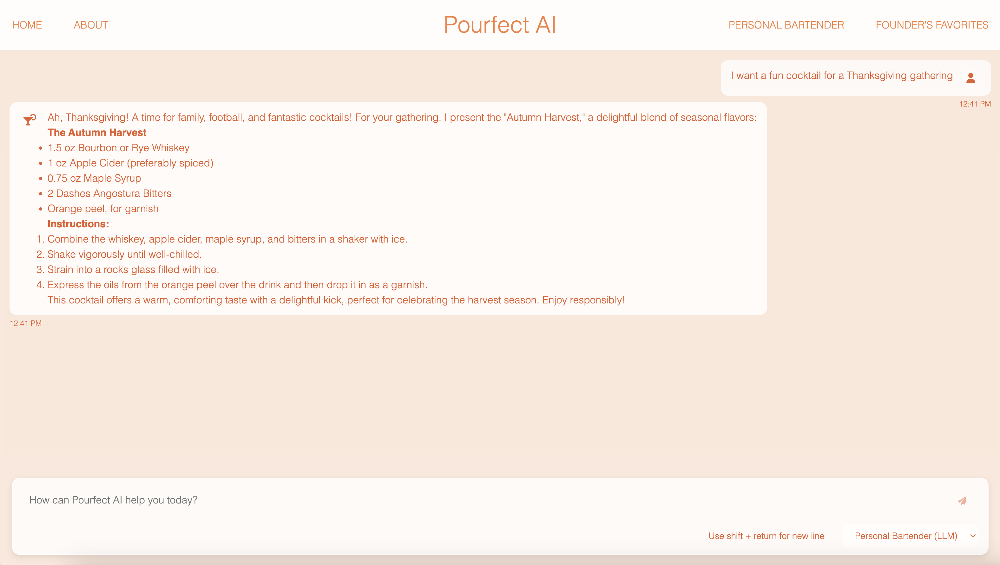

# AC215 - Pourfect AI 

**Team Members**

Niki Ekstrom, Soline Boussard, Michelle Hewson, Sydney Levy, Aida York

**Group Name**

Git Girls 

**Project: Pourfect AI**

In this project, we aim to develop a cocktail application that leverages user input and preferences to deliver personalized cocktail recommendations. Pourfect AI will allow users to input the ingredients they have on hand and instantly discover cocktail recipes that match, helping to reduce waste and optimize ingredient use. Furthermore, Pourfect AI also innovates by crafting unique cocktail recipes tailored specifically to the ingredients on hand. Users can also explore cocktails based on their taste preferences, occasion, or type of glass. Detailed recipe instructions will be provided, with either the alcoholic or non-alcoholic variations. 
The chatbot rememberS user preferences, ensuring a personalized and seamless cocktail-making experience. It is powered by a RAG model and fine-tuned LLM models, making it an expert in cocktail making. 


#### AC 215_GitGirls Project Milestone 4 Organization

```
├── Readme.md
├── .github/
│   └── workflows/
│       ├── ci-apiservice.yml
│       ├── ci-datapipeline.yml
│       ├── ci-frontend.yml
│       ├── ci-integration.yml
│       └── ci-models.yml
├── images/
│   ├── previous_milestones/
│   ├── api-list.png
│   ├── chatbot.png
│   ├── homepage.png
│   ├── solution_arch.png
│   └── technical_architecture.png
├── notebooks/
│   └── eda.ipynb
├── reports/
│   ├── previous_milestones/
│   ├── application_design_doc.pdf
│   └── test_documentation.pdf
├── src/
│   ├── api-service/
│   │   ├── chat-history/
│   │   ├── api/
│   │   ├── Dockerfile
│   │   └── Pipfile
│   ├── datapipeline/
│   ├── frontend-simple/
│   └── models/
└── tests/

```


### Milestone4 ###

In this milestone, we have the components for frontend, API service, and components from previous milestones for data management.

After completing the robust ML Pipeline in our previous milestone, we have built a backend api service and frontend app. This will be our user-facing application that ties together the various components built in previous milestones.

We also included a testing suite that tests the functionality of every part of our project together.

**Application Design**

Before we start implementing the app we built a detailed design document outlining the application’s architecture. We built a Solution Architecture and Technical Architecture to ensure all our components work together.

Solution Architecture:


Technical Architecture:


**Backend API**

We built backend api service using fast API to expose model functionality to the frontend. We also added apis that will help the frontend display some key information about the model and data.


**Frontend**

A user-friendly web application was built to help users discover personalized cocktail and mocktail recipes. Designed with using HTML and JavaScript, the application allows users to input their available ingredients or preferences and receive tailored drink recommendations. The app communicates with a backend API, which processes the inputs and returns recipes, including detailed instructions and variations, such as alcoholic or non-alcoholic options. This seamless interaction ensures a fun and engaging user experience for both cocktail enthusiasts and beginners.

The homepage of the website provides users with the option to learn more about Pourfect AI, chat with a personal bartender, or learn more about the favorite recipes of each of our founders. 


The chatbot page allows you to interact with your own personal bartender, allowing each user to find a recipe tailored to their needs. 


When you chat with your own personal bartender, you can save your favorite recipes from its generated responses by clicking on the heart icon. These saved recipes are then located on the Saved Recipes tab.


To set up / run the front-end:
- Open a terminal and cd into `src/datapipeline`
- Run `sh docker-shell.sh` to start the Docker container
- Run `python preprocess_rag.py` to start ChromaDB
- Open a new terminal and cd into `src/api-service`
- Run `sh docker-shell.sh` to start the Docker Containter 
- Inside the container, run `uvicorn_server`
- Open a new terminal and cd into `src/frontend-simple`
- Run `sh docker-shell.sh` to start the Docker Containter 
- Inside the container, run `http-server`

**Testing**

We wrote unit tests for the following pipelines: datapipeline, models, frontend-simple, and api-service. 
Additionally, we wrote integration tests that check that we can chat and get a reasonable response through our API. 
All tests can be found in the `tests` folder. 

To see how to run tests locally as well as additional documentation for how we created the unit tests and integration tests see `reports/test_documentation.pdf`

